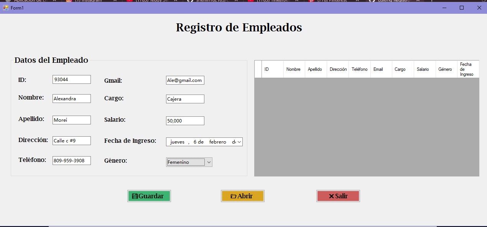
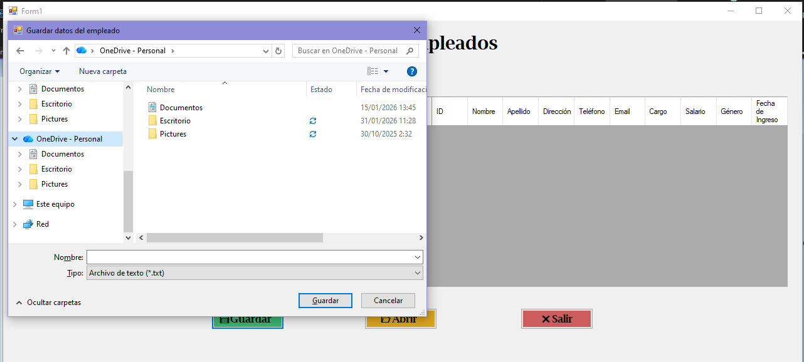
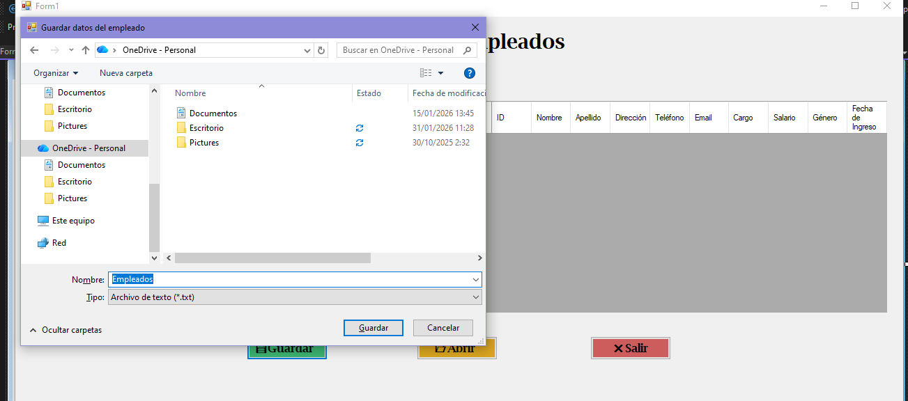
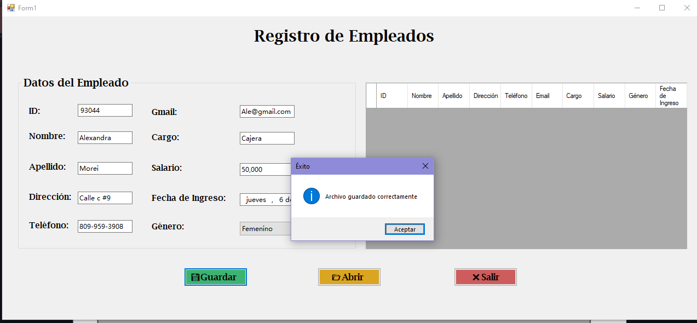
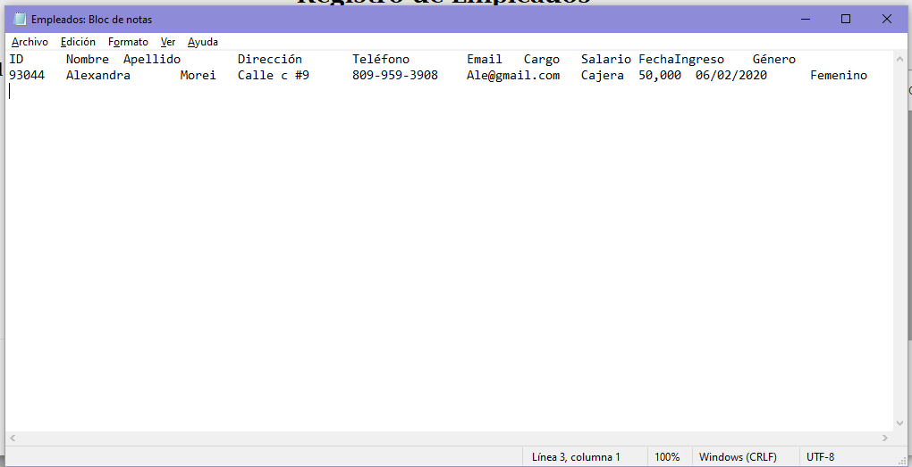
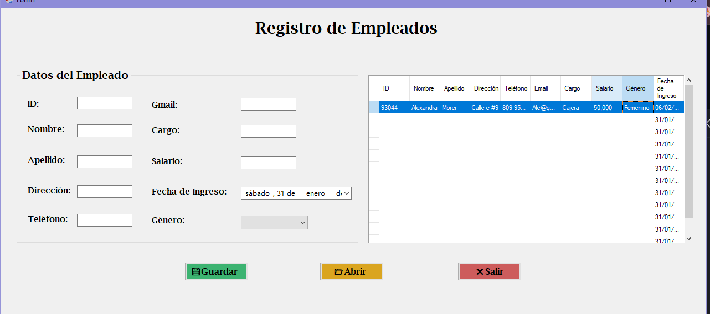

# 📋 Registro de Empleados – C# WinForms 💼✨

## 📝 Descripción del Programa
Esta aplicación permite **registrar, visualizar y organizar la información de empleados** mediante un formulario interactivo.  
El usuario puede ingresar los datos del empleado y almacenarlos temporalmente en una tabla (**DataGridView**), facilitando el control y la visualización de la información de manera clara y ordenada.  
El programa está diseñado con una interfaz amigable, aplicando principios de **usabilidad y accesibilidad**, y fue desarrollado con fines académicos.

---

## 🛠️ Tecnologías Utilizadas
- 💻 Lenguaje: **C#**
- 🧩 Plataforma: **.NET Framework**
- 🎨 Interfaz gráfica: **Windows Forms**
- 🛠️ IDE: **Visual Studio**

---

## ✨ Funcionalidades
- 📌 Registro de empleados con los siguientes datos:
  - ID
  - Nombre
  - Apellido
  - Dirección
  - Teléfono
  - Email
  - Cargo
  - Salario
  - Género
  - Fecha de ingreso
- 📊 Visualización de los datos en un **DataGridView**
- 💾 Guardado de la información ingresada
- 🧹 Limpieza de campos del formulario
- 🎯 Interfaz organizada y fácil de usar

---

## 🖼️ Evidencias del Proyecto

| | | |
|---|---|---|
|  |  |  |
|  |  |  |

---

## 🚀 Ejecución del Proyecto
1. Clonar el repositorio:
   ```bash
  [(https://github.com/sherlin182103/Manejo-de-archivos-de-texto/edit/main/README.md)]

  ## 🎓 Contexto Académico

📚 **Nivel:** Secundaria Técnico Profesional  
🧩 **Módulo Formativo:** Desarrollo de Aplicaciones  
🏫 **Curso / Sección:** 5D2  
📆 **Año Escolar:** 2025 / 2026  

---

## 👩‍💻 Autoras 💕

🌸 **Angela Santana**  
🌸 **Sherlin Jiménez**  

💗 *Proyecto realizado por Sherlin Y Alvelis con trabajo en equipo, responsabilidad y creatividad.*
